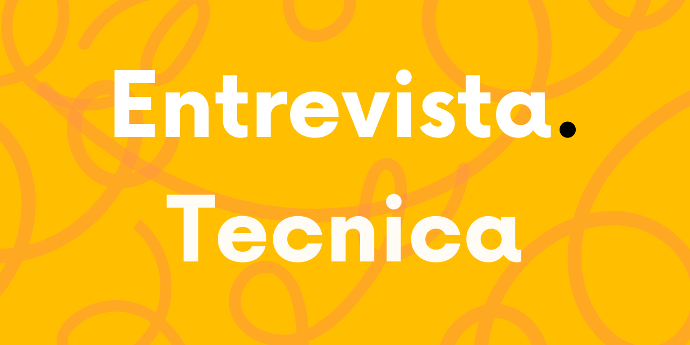

# 📖 Guía para Entrevistas Laborales de Programación  


Este repositorio es un recurso abierto para ayudarte a prepararte para entrevistas técnicas en programación. Aquí encontrarás teoría, ejemplos de código, pruebas técnicas, desafíos prácticos y simulacros de entrevistas.

🚀 **Objetivo**: Brindar una guía completa con preguntas comunes, resolución de problemas y simulacros para mejorar tus habilidades.

📌 **Índice**
1. [Fundamentos](#%EF%B8%8F-fundamentos)
2. [Stacks Tecnológicos](#-stacks-tecnológicos)
3. [Pruebas Técnicas](#-pruebas-técnicas)
4. [Simulacros de Entrevistas](#-simulacros-de-entrevistas)
5. [Cómo Contribuir](#-cómo-contribuir)

---

## 🏗️ Fundamentos
Esta sección cubre conceptos esenciales en programación y herramientas clave.  
Cada tema contiene preguntas comunes, ejemplos de código y recursos adicionales.

📌 **Temas Incluidos**:
- **Git** → [Preguntas Frecuentes](fundamentos/git/readme.md)  
- **HTML & CSS** → [Preguntas Frecuentes](fundamentos/html/readme.md)  ( ⚠️ En desarrollo ⚠️ )
- **JavaScript** → [Preguntas Frecuentes](fundamentos/javascript/readme.md) 
- **POO (Programación Orientada a Objetos)** → [Preguntas Frecuentes](fundamentos/poo/readme.md)  

---

## 🚀 Stacks Tecnológicos ( ⚠️ En desarrollo ⚠️ )
Exploramos preguntas y desafíos específicos para distintos stacks.

📌 **Stacks Incluidos**:
- [React](stacks/react) ( ⚠️ En desarrollo ⚠️ )
- [Angular](stacks/angular) ( ⚠️ En desarrollo ⚠️ )
- [Node.js](stacks/node)  ( ⚠️ En desarrollo ⚠️ )
- [MEAN Stack](stacks/mean) ( ⚠️ En desarrollo ⚠️ )
- [MERN Stack](stacks/mern) ( ⚠️ En desarrollo ⚠️ )
- [Java Backend](stacks/java-backend) ( ⚠️ En desarrollo ⚠️ )

Cada stack tiene preguntas técnicas y ejercicios aplicados a entrevistas reales.

---

## 🧠 Pruebas Técnicas
La clave para superar entrevistas técnicas es la práctica constante. Aquí encontrarás desafíos y pruebas técnicas.

📌 **Tipos de Pruebas**:
- **Lógica y Algoritmos** → [Ejercicios](pruebas-tecnicas/desafios/logica) ( ⚠️ En desarrollo ⚠️ )
- **Estructuras de Datos** → [Ejercicios](pruebas-tecnicas/desafios/estructuras-de-datos) ( ⚠️ En desarrollo ⚠️ )
- **Desarrollo Frontend UI** → [Ejercicios](pruebas-tecnicas/desafios/frontend-ui) ( ⚠️ En desarrollo ⚠️ )

Ejemplo de un desafío:
```js
// Dado un string, encuentra la subcadena más larga sin caracteres repetidos
const longestSubstring = (s) => {
  let seen = new Set(), maxLen = 0, left = 0;
  for (let right = 0; right < s.length; right++) {
    while (seen.has(s[right])) {
      seen.delete(s[left]);
      left++;
    }
    seen.add(s[right]);
    maxLen = Math.max(maxLen, right - left + 1);
  }
  return maxLen;
};
console.log(longestSubstring("abcabcbb")); // Output: 3
```

---

## 🎭 Simulacros de Entrevistas
Prueba tus habilidades con entrevistas simuladas y escenarios reales.

📌 **Tipos de Simulacros**:
1. **Entrevistas de Algoritmos y Lógica**
2. **Entrevistas de Código en Varios Lenguajes**
3. **Casos Prácticos de Desarrollo**
   
Accede a guías y ejemplos en la carpeta [Simulacros](simulacros/). ( ⚠️ En desarrollo ⚠️ )

---

## 🤝 Cómo Contribuir
📌 Si deseas contribuir, sigue estos pasos:
1. **Clona el repositorio**  
   ```sh
   git clone https://github.com/holasoymalva/Guia-para-Entrevistas-Laborales-de-Programacion.git
   ```
2. **Crea una nueva rama**  
   ```sh
   git checkout -b mi-contribucion
   ```
3. **Realiza cambios y sube tus mejoras**
4. **Haz un Pull Request**

**¡Gracias por tu apoyo!** 💙

---
<p align="center">Hecho con ❤️ por <a href="https://holasoymalva.com">@holasoymalva</a></p>
